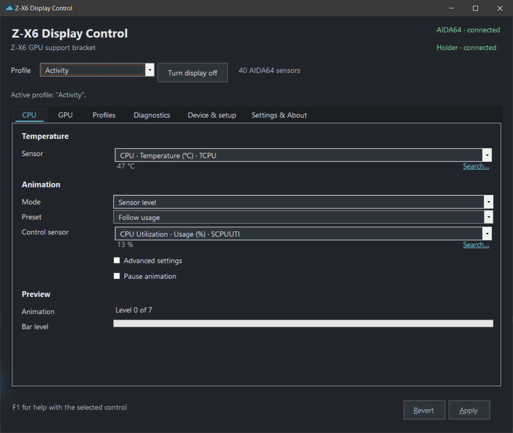
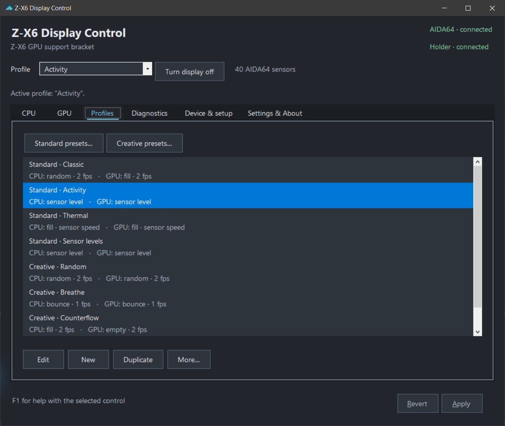

# 🖥️ Z-X6 Display Control

Choose which sensors and animations your Z-X6 display uses.

Z-X6 Display Control is a portable Windows app for the
[Z-X6 GPU support bracket display](https://powertrain-pc.com/products/147/).
It uses sensor readings from AIDA64 to show temperatures and animate the bars.
Configure the CPU and GPU sides separately, save your choices as profiles and
keep the display running from the Windows tray.

## 🧩 What you can control

- **Temperature sources:** choose the sensor shown on each side.
- **Bar animations:** fill, empty, bounce or random, with fixed speed or speed
  that follows a sensor reading.
- **Bar levels:** show a sensor value as a level, or hold a fixed level.
- **Profiles:** use the included presets, create your own and import or export them.
- **Daily operation:** turn the display on or off, use tray controls, choose
  light, dark or system appearance, and optionally start with Windows.

The app reconnects automatically when the USB connection becomes available
again and resumes updates when valid AIDA64 readings return.

## 📦 Before you start

**Current version: `0.1.0-beta.1`.** This is a beta build and the executable is unsigned.

You need:

- A Z-X6 holder with the CPU/GPU temperature display.
- Windows with .NET Framework 4.7.2 or later.
- AIDA64 installed and running, with shared memory enabled.

This beta supports **one Z-X6 at a time**. If multiple matching displays are
detected, updates stop until only one remains.

The app controls the two temperature readouts and their bars. It has no controls
for RGB lighting, brightness, custom images or firmware updates. Other holder
models and firmware variants have not been verified.

## 🚀 Get started

1. Download `ZX6DisplayControl.zip` from
   [Releases](https://github.com/XxYouDeaDPunKxX/zx6-display-control/releases)
   and extract the entire package. Keep `ZX6DisplayControl.Core.dll` beside
   `ZX6DisplayControl.exe`.
2. In AIDA64, open **Preferences > Hardware Monitoring > External Applications**.
   Enable shared memory and select the sensors you want to use.
3. Disable **LCD > Turing** in AIDA64 and close the original GPU LCD software
   so this app can use the holder's serial port.
4. Run `ZX6DisplayControl.exe`, choose a profile or configure each side, then
   select **Apply**. Administrator rights are not required.

The default temperature sources are `TCPU` and `TGPU1`. If they are unavailable,
choose the appropriate exported sensors in the app. For animations that follow
usage, export CPU Utilization (`SCPUUTI`) and GPU Utilization (`SGPU1UTI`) in AIDA64.

See the [user guide](docs/Guide.txt) for sensor selection, animation settings,
profiles and tray behavior. Hover over a control or press **F1** for help in the app.

## 📸 Screenshots

**CPU controls:** temperature selection and a bar driven by CPU usage.



**Profiles:** saved configurations with separate CPU and GPU settings.



---

<details>
<summary>⚙️ Technical details & contributing</summary>

### 🏗️ Architecture and execution model

The application is C# 5 with Windows Forms, targeting .NET Framework 4.7.2.
`ZX6DisplayControl.exe` is the entry point; `ZX6DisplayControl.Core.dll` contains
the interface and controller implementation. The two files must stay together.

The data path is:

```text
AIDA64 shared memory
  → parsed sensor snapshot
  → independent CPU/GPU temperature and animation settings
  → bar levels and temperature digits
  → serial packets
  → Z-X6 display
```

| Component | Responsibility |
| --- | --- |
| [SharedMemoryReader](src/Aida/SharedMemoryReader.cs) and [ExportParser](src/Aida/ExportParser.cs) | Read and decode the AIDA64 export. |
| [AnimationEngine](src/Animation/AnimationEngine.cs) | Convert elapsed time and sensor values into bar levels. |
| [PacketCodec](src/Holder/PacketCodec.cs) | Encode temperatures, bar levels and display commands. |
| [DeviceDiscovery](src/Windows/DeviceDiscovery.cs) and [SerialTransport](src/Windows/SerialTransport.cs) | Find the matching COM port and own its serial connection. |
| [HolderSession](src/Session/HolderSession.cs) | Schedule reads and writes, manage display power and reconnect. |
| [SessionController](src/Session/SessionController.cs) | Run the session on a background thread and queue commands from the UI. |
| [MainForm](src/UI/MainForm.cs) and [SettingsStore](src/Settings/SettingsStore.cs) | Edit profiles, save settings and present session state. |

The serial connection belongs to one background worker. UI commands such as
Apply, Reconnect, Suspend and Resume enter a concurrent queue; the worker
processes them before its next session tick. Configuration is copied when
queued, so subsequent editor changes do not modify an already queued command.
The UI reads the latest published session state rather than performing serial
I/O itself. File operations run asynchronously, with editing disabled while
an operation is pending.

### 🌡️ AIDA64 export and sensor selection

The reader checks for the `aida64` process and opens the existing
`AIDA64_SensorValues` memory map with read-only access. It reads only the sensors
that AIDA64 exports through shared memory; it does not change AIDA64 preferences
or read CPU/GPU hardware sensors directly.

The parser accepts null-terminated UTF-16 little-endian data, detected through
a BOM or its initial bytes, or the Windows default encoding.
Exports are limited to **1 MiB**. The XML fragments are wrapped in an internal
`<export>` root; DTD processing is prohibited and external XML resolution is
disabled. An incomplete export, duplicate sensor ID, missing ID/value or
ambiguous field makes the read invalid.

Each sensor retains its ID, label, measurement type, raw value, inferred unit
and nullable numeric value. Numbers use invariant-culture parsing; non-numeric
values, NaN and infinity do not become numeric readings. Units include °C,
RPM, %, V, A and W; known CPU/GPU utilization IDs are recognized as percentages.
The sensor picker can filter by name, ID and measurement type.

Each display side has two independent choices:

- `TemperatureId` supplies its temperature number. It must identify a numeric
  `temp` sensor with a value in **0–99 °C**.
- `Animation.SensorId` supplies its bar animation when the selected mode needs
  a sensor. It can differ from the displayed temperature source.

Both temperature sources must be valid before a snapshot refreshes the
display's last-good temperature pair. Defaults are `TCPU` and `TGPU1`;
usage presets select `SCPUUTI` and `SGPU1UTI`. Other exported temperature
sources, such as a GPU hotspot, can be selected explicitly.

The snapshot time records receipt by this app. AIDA64's export does not
provide a sensor-production timestamp, so unchanged values are not treated
as proof that a sensor is stale. Diagnostics retains the last snapshot when
reads fail and labels it as the last received data.

### 🔌 Device discovery and serial connection

Discovery queries Windows WMI `Win32_PnPEntity` for COM-port devices and requires
a healthy device whose instance ID exactly matches:

```text
USB\VID_1A86&PID_5722\USB35INCHIPSV2
```

The port name is extracted from the device's friendly name, such as
`(COM5)`. This is an exact device-instance match, not a general search for
every device with vendor/product IDs `1A86:5722`. The interface is identified
as Turing / UsbMonitor; matching identifiers on another product or firmware
do not establish compatibility.

This beta connects only when discovery returns exactly one matching holder.
If more than one is detected, the connection is closed and updates stop until
only one remains. Diagnostics shows the detected display and its COM port;
there is no device-selection control.

Serial settings are **115200 baud, eight data bits, no parity, one stop bit**
with DTR and RTS enabled and a **1000 ms write timeout**. Only one application
can own the port, which is why AIDA64's Turing LCD output and the original
GPU LCD utility must release it.

After opening the port, the session waits at least **100 ms** before sending
initialization. It sends temperature/bar updates only after initialization
and while the display has valid temperatures and is enabled. The transport
writes packets; it does not read acknowledgements from the holder.

### 📡 Display packet format

[PacketCodec.cs](src/Holder/PacketCodec.cs) defines the packet format implemented
by this app. Temperature updates are **20 bytes**. Temperatures are truncated
to whole degrees before encoding; bar levels are integers from **0 to 7**.

| Byte offset | Value |
| --- | --- |
| `0` | `0x00` |
| `1` | GPU temperature shifted right by four bits: `gpu >> 4` |
| `2` | GPU low nibble shifted left: `(gpu & 0x0F) << 4` |
| `3–4` | `0x00` |
| `5` | Fixed marker `0xA9` |
| `6` | CPU tens digit |
| `7` | CPU units digit |
| `8` | GPU tens digit |
| `9` | GPU units digit |
| `10` | CPU bar level |
| `11` | GPU bar level |
| `12–19` | `0x00` |

Digit bytes contain numeric values `0–9`, not ASCII characters. For example,
CPU **42 °C**, GPU **65 °C**, CPU level **3** and GPU level **6** produce:

```text
00 04 10 00 00 A9 04 02 06 05 03 06 00 00 00 00 00 00 00 00
```

Control packets are **six bytes**: five zero bytes followed by the command.

| Command | Hex | Packet |
| --- | --- | --- |
| Initialize | `0xFF` | `00 00 00 00 00 FF` |
| Display off | `0x6C` | `00 00 00 00 00 6C` |
| Display on | `0x6D` | `00 00 00 00 00 6D` |

Display power changes are sent when the requested state changes, rather than
on every data update. The write counter counts successful serial write calls,
including control packets; it is not confirmation that the holder acknowledged
or rendered a packet.

### ⏱️ Scheduling, power and recovery

Scheduling uses a `Stopwatch`-based monotonic clock.

| Operation | Scheduled interval or delay |
| --- | --- |
| Worker idle wait | `25 ms`, interruptible by queued commands |
| Read AIDA64 | `500 ms` |
| Send temperature/bar data | `125 ms`, up to eight updates per second |
| Retry connection / check device presence | `3000 ms` |
| Initialize after opening the port | At least `100 ms` |
| Last-good temperature allowance | `5000 ms` |
| Refresh UI and editor previews | `125 ms` |

These are scheduling targets; Windows scheduling, discovery and serial I/O
can delay a tick.

- **No valid temperature pair yet:** keep the display off after initialization.
- **Temperature data lost or invalid:** request display off after more than
  five seconds since the last valid pair. Resume automatically when both
  temperatures become valid again, if the user has enabled the display.
- **Only an animation source lost:** hold that side's last bar level while
  valid temperature numbers continue updating.
- **USB removed or a write fails:** close the connection and retry discovery.
- **Port busy:** report the conflict and retry; another process must release
  the port before this app can open it.
- **Multiple matching displays detected:** stop updates and request that only
  one holder remain connected; retry automatically once the ambiguity clears.
- **Display disabled by the user:** retain that choice across reconnects and
  suspend/resume, even when valid sensor data returns.

`Reconnect` makes the next read, discovery and presence check immediately due.
On Windows suspend the session requests display off and closes the port.
On resume it clears timing/animation state and starts reading and reconnecting
again. Cleanup errors remain visible in session status and the event log.

### 🎞️ Animation modes, mapping and smoothing

CPU and GPU use separate animation engines, settings and random generators.
Temperature selection does not implicitly select the animation-control sensor,
except when using the explicit **Follow temperature** preset.

| Mode | Behavior |
| --- | --- |
| Loop | Advance Fill, Empty, Bounce or Random at a fixed or sensor-driven speed. |
| Sensor level | Map the selected sensor to one of eight bar levels. |
| Fixed level | Hold the chosen level `0–7`. |

Loop patterns operate on the built-in levels:

- **Fill:** increment and wrap, `0 → 1 → … → 7 → 0`.
- **Empty:** decrement and wrap, `7 → 6 → … → 0 → 7`.
- **Bounce:** move between both ends without jumping from full to empty.
- **Random:** choose a different level from the preceding one.

Fixed and sensor-driven loop speeds must stay within **1–4 fps**; decimal
values are accepted. Slow, Normal and Fast use **1, 2 and 4 fps** respectively.
A delayed worker does not replay an animation backlog to USB: a loop advance
with more than one second of elapsed time skips that elapsed interval.

For a sensor value `x`, lower bound `a` and upper bound `b`, the engine computes:

```text
n = clamp((x - a) / (b - a), 0, 1)
inverted response: n = 1 - n
sensor-driven speed = minFps + n × (maxFps - minFps)
sensor-level candidate = floor(7 × n)
```

The upper input bound must exceed the lower bound. Out-of-range values clamp
to the nearest end rather than extending the speed or bar range.
**Follow usage** uses `0–100%`; **Follow temperature** uses `30–80 °C` and the
selected display-temperature sensor. Both presets use a two-second response
time. When changing to a sensor with an unknown preset range, such as RPM or
watts, the editor requires the input range to be reviewed and confirmed in
Advanced settings.

Response time can be **Off, 1, 2 or 5 seconds**. With smoothing enabled, the
filtered value is updated using elapsed time `dt` and response time `tau`:

```text
alpha = 1 - exp(-dt / tau)
filtered = previousFiltered + (x - previousFiltered) × alpha
```

The first valid sample initializes the filter. With response time Off,
the current sample is used directly.

Sensor-level mode also applies **0–10% hysteresis**, defaulting to **2%**,
around level boundaries. With current level `k` and margin `h` expressed as
a fraction, an upward change requires `n ≥ (k + 1) / 7 + h`; a downward
change requires `n ≤ k / 7 - h`. The first sample and normalized endpoints
take their candidate level directly. This prevents repeated level changes
when a sensor hovers around a boundary.

**Pause animation** holds only the bar; temperatures keep updating.
Changing animation settings resets that engine. The UI preview has its own
engines and uses the current editor draft, so it can show pending changes
before those changes are applied to the holder.

### 🗂️ Profiles, drafts and persistence

[Profile.cs](src/Settings/Profile.cs) defines a profile as a name plus separate
`Cpu` and `Gpu` channel settings. Each channel contains `TemperatureId`,
`Animation` and `Paused`. App settings contain the profile collection, active
profile name, display power, startup/tray choices and appearance.

The editor keeps saved settings and a working copy. Selecting or editing
a profile changes the draft. **Apply** validates it, saves settings and queues
the new session configuration; **Revert** restores the saved copy.
Collection changes such as adding, renaming, deleting, importing or restoring
profiles also remain pending until Apply. Display power is saved and applied
as a separate action, without applying unrelated draft edits.

Profile names must be non-empty and unique without regard to case. At least
one profile must remain. JSON import/export uses a `ProfileDocument` containing
`SchemaVersion: 1` and `Profile`. Invalid fields or unsupported schema versions
are rejected, and replacing an existing name requires a choice in the UI.

The editable preset library starts with:

| Preset | Default behavior |
| --- | --- |
| Classic | Both bars fill at a steady `2 fps`. |
| Activity | CPU/GPU usage independently controls animation speed. |
| Thermal | Each displayed temperature controls speed over `30–80 °C`. |
| Sensor levels | CPU/GPU usage controls bar level. |
| Random | Independent random levels at `2 fps`. |
| Breathe | Both bars fill and empty at `1 fps`. |
| Counterflow | CPU fills while GPU empties at `2 fps`. |
| Split tempo | CPU fills at `1 fps`; GPU fills at `4 fps`. |

[SettingsStore.cs](src/Settings/SettingsStore.cs) stores data under
`%LOCALAPPDATA%\ZX6DisplayControl`:

- `settings.json`: current app settings, schema version `1`.
- `settings.previous.json`: the previous valid settings.
- `settings.corrupt-*.json`: an invalid current file retained when a new save
  replaces it.

Saves write a uniquely named temporary file before replacing the current
file. A valid previous file becomes the backup. Loading tries current
settings, then the backup, then defaults; recovery reports a warning and
retains the original files. Imported and stored JSON documents are limited
to **1 MiB**.

### 🪟 Tray, startup, appearance and shutdown

The app uses a named mutex scoped to the Windows user SID. A second launch
signals the existing instance to show its window instead of starting another
controller.

Close to tray is enabled in default settings; minimize to tray is a separate
option. Hiding the window leaves the worker running. **Exit** waits for an
active file operation and controller cleanup, reporting progress if either
takes more than five seconds. The controller requests display off and
disposes the serial port; cleanup failures are reported.

Start with Windows is opt-in. It writes this executable's full path and
`--tray` to the current user's `Software\Microsoft\Windows\CurrentVersion\Run`
key, without requiring administrator rights. If the app is moved, disable
and re-enable startup from its new location. When saving startup preferences,
the previous registry value is restored if settings persistence fails.

Light, Dark and System appearance preview immediately; Apply saves the choice
and Revert restores it. System follows the Windows app color preference,
checked every three seconds, while high contrast takes precedence.
Native file pickers keep Windows styling. The interface uses DPI scaling
and F1/hover help for its controls.

### 🩺 Diagnostics and local data

The app makes no network requests. Diagnostics exposes the exported sensor
catalog, selected device, connection states, receipt time and counters:

- **Valid reads:** successfully parsed sensor snapshots, even if a selected
  display-temperature value is subsequently rejected.
- **Read errors:** failed reads or invalid exports.
- **Writes:** completed serial write calls, including initialization and
  power commands.

[EventLog.cs](src/Diagnostics/EventLog.cs) retains the latest **200 events**
in memory. It writes `events.log` and rotates it to `events.previous.log`
when the next entry would exceed **1 MiB**. Session transitions, file-operation
results and periodic counters are recorded. Disk-log failures remain visible
in the UI even when the file cannot be written.

A diagnostic export includes app version, device and connection status,
counters, the active profile as JSON, available log files and current-session
events. It does not include AIDA64's INI/license or the complete sensor catalog.
Review the report before sharing it.

### 🛠️ Build, packaging and source traceability

Build requirements are Windows PowerShell 5.1, the .NET Framework C# compiler
and the .NET Framework 4.7.2 Developer Pack reference assemblies. There are no
NuGet dependencies or restore step. [Build.ps1](Build.ps1) invokes `csc.exe`
directly with C# 5, optimization and warnings treated as errors.

From the source folder:

```powershell
.\Build.ps1
.\Package.ps1 -UseExistingBuild
```

The build produces the Core DLL, GUI executable and test executable in
`bin/`. It embeds the app icon and Windows manifest and writes
`build-info.json` with SHA-256 fingerprints for source inputs and binaries.
The existing local suite can be run with `.\Test.ps1`; building its executable
does not itself run it.

[Package.ps1](Package.ps1) requires Git and a clean, committed working tree.
It compares current source and binary hashes against the build record before
packaging. `-UseExistingBuild` uses that matching build without running tests;
without that switch, packaging invokes `Test.ps1` first.

Output in `dist/`:

- `ZX6DisplayControl.zip`: the app, Core DLL, user guide, MIT license and
  `Version.txt` with app version, source commit and packaging time.
- `ZX6DisplayControl-source.zip`: a Git archive of the committed source.
- `SHA256.txt`: checksums for both archives and the portable-package files.

The portable archive excludes tests and developer tools. `bin/`, `obj/` and
`dist/` are ignored by Git. The source ZIP comes from the committed revision,
while the fingerprint checks prevent packaging a stale or modified build.

### 🤝 Contributing

Contributions are welcome. Use
[Issues](https://github.com/XxYouDeaDPunKxX/zx6-display-control/issues)
for bugs and feature requests, and
[Discussions](https://github.com/XxYouDeaDPunKxX/zx6-display-control/discussions)
for questions and ideas.

For device reports, include the holder model, USB identifiers, Windows version,
selected sensor IDs and relevant diagnostic details. Explain whether the
problem concerns AIDA64 readings, port access, display values or animations.
For pull requests, describe the change and what you checked. Keep changes
compatible with the C# 5 / .NET Framework 4.7.2 build.

</details>

---

## 📄 License

MIT. See [LICENSE](LICENSE).

## 🤖 AI-assisted development

This project was developed with AI assistance.

The project, documentation, and repository materials were shaped through human-directed work supported by AI tools during drafting, structuring, review, and refinement.

AI assistance does not make the project automatically correct, complete, or suitable for every use case. Read it, test it, and adapt it to your own context.
